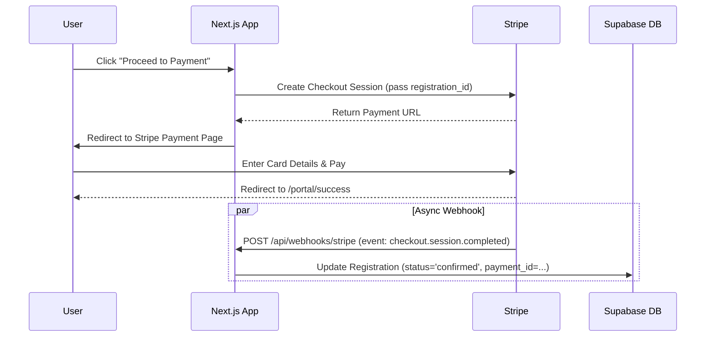

# Stripe Payment Integration Guide

Using **Stripe** is the standard for modern web apps. It uses a **Pay-as-you-go** model, meaning there are no upfront costs or monthly fees.

## 1. Pricing Model (Standard)
*   **Cost**: 2.9% + 30¢ per successful card charge.
*   **Monthly Fees**: $0.
*   **Setup Cost**: $0.
*   **Failed Transactions**: Free.
*   *Note: International cards or currency conversion may add small additional fees (~1%).*

## 2. Recommended Architecture
We will use **Stripe Checkout**. This is the most secure and easiest method.



## 3. Implementation Steps

### Phase 1: Setup
1.  Create a free account at [dashboard.stripe.com](https://dashboard.stripe.com/register).
2.  Get API Keys: `NEXT_PUBLIC_STRIPE_PUBLISHABLE_KEY` and `STRIPE_SECRET_KEY`.
3.  Install libraries:
    ```bash
    npm install stripe @stripe/stripe-js
    ```

### Phase 2: Schema Updates
Ensure your `registrations` table has these columns (already present in your schema):
*   `status` (text) - default 'pending_payment'
*   `payment_id` (text) - to store the Stripe Transaction ID

### Phase 3: Create Server Action (The Trigger)
Create `app/portal/payment/actions.ts`:
*   Function `startPayment(registrationId)`
*   Fetches registration details.
*   Calls `stripe.checkout.sessions.create`:
    *   `mode`: 'payment'
    *   `line_items`: [{ price_data: { currency: 'usd', product_data: { name: 'Competition Fee' }, unit_amount: 5000 }, quantity: 1 }]
    *   `metadata`: { registrationId: registration.id } **(CRITICAL)**
    *   `success_url`: `${process.env.NEXT_PUBLIC_BASE_URL}/portal?success=true`
    *   `cancel_url`: `${process.env.NEXT_PUBLIC_BASE_URL}/portal?canceled=true`
*   Returns the `url` to redirect to.

### Phase 4: Webhook Handler (The Confirmation)
Create `app/api/webhooks/stripe/route.ts`:
*   **Verification**: Construct the event securely using `stripe.webhooks.constructEvent` and your Webhook Signing Secret.
*   **Logic**:
    ```typescript
    if (event.type === 'checkout.session.completed') {
        const session = event.data.object;
        const regId = session.metadata.registrationId;
        
        // Update Supabase
        await supabaseAdmin.from('registrations')
            .update({ status: 'confirmed', payment_id: session.id })
            .eq('id', regId);
    }
    ```
*   *Note: You will need a `supabaseAdmin` client (service_role key) to bypass RLS for this background task.*

## 4. Testing
Stripe provides "Test Mode" keys. You can use fake credit card numbers (like `4242 4242 4242 4242`) to test the entire flow without spending real money.
